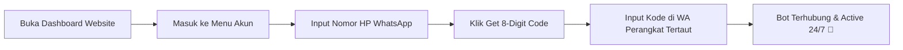

<div align="center">

  # 🎀 CAILIN ASSISTANT v2.0.0
  ### ⚡ Next-Gen Web & WhatsApp Bot Engine ⚡

  [](https://nextjs.org/)
  [](https://github.com/WhiskeySockets/Baileys)
  [](https://github.com/RynnStecu/Cailin-Asistent)
  [](https://nodejs.org/)
  [](LICENSE)

  <p align="center">
    <b>Platform Otomatisasi WhatsApp Modern dengan Web Dashboard Neobrutalism Ultra-Fast</b>
    <br />
    <i>Sistem Multi-Session Bot Clone, Live Terminal Stream, Generator Kode Pairing 8-Digit Instan, & 150+ Modul Feature.</i>
  </p>

  ---

  [🛠️ Tech Stack](#-tech-stack--teknologi) •
  [✨ Fitur Utama](#-fitur-unggulan) •
  [📂 Struktur Proyek](#-struktur-proyek) •
  [🚀 Instalasi](#-instalasi--memulai) •
  [📲 WhatsApp Pairing](#-menghubungkan-whatsapp) •
  [🛰️ API Endpoints](#-serverless-api-endpoints)

</div>

<br />

---

## 🛠️ Tech Stack & Teknologi

<p align="center">
  
  
  
  
  
  <br />
  
  
  
  
</p>

| Komponen | Teknologi / Library | Deskripsi |
| :--- | :--- | :--- |
| **Frontend Framework** | `Next.js 14 (App Router)` & `React 18` | Dashboard web interaktif dan SSR/Serverless API Endpoints |
| **Bot Engine Core** | `@whiskeysockets/baileys` (ESM) | Library WhatsApp Multi-Device Protocol socket handler |
| **Styling System** | `Vanilla CSS` + `Neobrutalism Design System` | Tampilan retro-futuristik berkecepatan tinggi & responsif |
| **Runtime & Environment** | `Node.js v18+ / v20+` | Server runtime pendukung Dual Engine Launcher (`start-all.js`) |
| **Network & Tunneling** | `Cloudflare Tunnel (cloudflared)` | Fitur expose localhost ke publik secara otomatis & aman |
| **Containerization** | `Docker` & `Docker Compose` | Dukungan deployment mandiri berbasis container |

<br />


---

## 🌟 Fitur Unggulan

<table>
  <tr>
    <td width="50%">
      <h3>🎨 Neobrutalism UI Dashboard</h3>
      <p>Antarmuka web retro-futuristik berkecepatan tinggi dengan skema warna vibrant, border tebal 4px, dan efek bayangan 3D solid yang memukau.</p>
    </td>
    <td width="50%">
      <h3>📱 8-Digit Pairing Code</h3>
      <p>Penautan WhatsApp instan tanpa scan QR Code. Otomatis mendukung format nomor Indonesia baik <code>08...</code> maupun <code>628...</code>.</p>
    </td>
  </tr>
  <tr>
    <td width="50%">
      <h3>🔄 Multi-Session & Auto Clone</h3>
      <p>Manajemen bot clone dengan persistensi otomatis di <code>data/clones.json</code>. Otomatis restore sesi saat server di-restart.</p>
    </td>
    <td width="50%">
      <h3>🛡️ Auto Recovery & Anti-Loop</h3>
      <p>Proteksi <b>Anti Status 440 Loop</b> (login conflict) serta <b>Bad-Session Auto Cleaner</b> untuk menjaga koneksi socket tetap stabil 24/7.</p>
    </td>
  </tr>
  <tr>
    <td width="50%">
      <h3>🌐 Cloudflare Tunnel Native</h3>
      <p>Dukungan penuh Cloudflare Tunnel (via <code>config_overrides.json</code> / <code>process.env</code>) dengan pendeteksian biner <code>cloudflared</code> otomatis.</p>
    </td>
    <td width="50%">
      <h3>🧩 150+ Modul Fitur ESM</h3>
      <p>Ekosistem plugin modular serbaguna: <i>AI Chat, Downloader, Game RPG, Stalker, Photo Maker, & Control Owner</i>.</p>
    </td>
  </tr>
</table>

<br />

---

## 📂 Struktur Proyek

```text
📦 Cailin-Asistent
 ├── 📁 app/                    # 🌐 Web Dashboard Next.js (App Router)
 │   ├── 📁 api/                # ⚡ Serverless API Endpoints (Account, Status, Logs, Cmds)
 │   ├── 📄 globals.css         # 🎨 Neobrutalism Design System CSS
 │   ├── 📄 layout.js           # 🧱 Root Layout & Custom Metadata
 │   └── 📄 page.js             # 💻 Single Page App Dashboard
 ├── 📁 core/                   # 🧠 Core Bot Engine
 │   ├── 📄 config.js           # ⚙️ Global Config & Cloudflare Tunnel Settings
 │   ├── 📄 loader.js           # 🔌 Dynamic ESM Command Loader
 │   └── 📄 serialize.js        # 📩 Baileys Message Serializer
 ├── 📁 data/                   # 💾 Data Persistence Store (JSON DB)
 │   ├── 📄 config_overrides.json
 │   ├── 📄 clones.json
 │   └── 📄 database.json
 ├── 📁 lib/                    # 🛠️ Core Helpers & Utilities
 │   ├── 📄 cloneManager.js     # 🤖 Session Manager & Reconnect Handler
 │   └── 📄 makeHelper.js       # 🔌 Socket Decorator & Preview Handler
 ├── 📁 plugins/                # 🧩 150+ ESM Command Plugins
 │   ├── 📁 ai/                 # 🤖 ChatGPT, Character AI, Prompt Tools
 │   ├── 📁 downloader/         # 📥 TikTok, IG, YouTube, Spotify, Pinterest
 │   ├── 📁 rpg/                # ⚔️ Adventure, Dungeon, Hunt, Market
 │   ├── 📁 tools/              # 🔧 Image Editor, Turnstile, Web Scraper
 │   └── 📁 owner/              # 👑 Owner Control & System Settings
 ├── 📄 index.js                # 🚀 Primary Baileys Engine Entrypoint
 ├── 📄 start-all.js            # 🔀 Dual Engine Launcher (Next.js + Bot)
 └── 📄 package.json            # 📦 Dependencies & Script Runner
```

<br />

---

## 🚀 Instalasi & Memulai

### 1. Prasyarat Sistem
- **Node.js**: `v18.x` atau `v20.x` *(Direkomendasikan Node 20 LTS)*
- **NPM / PNPM / Yarn**
- **Git CLI**

### 2. Clone Repository & Install Dependencies
```bash
# Clone repository
git clone https://github.com/RynnStecu/Cailin-Asistent.git

# Masuk ke direktori
cd Cailin-Asistent

# Install dependensi
npm install
```

### 3. Konfigurasi Tunnel (Opsional)
Jika Anda menggunakan **Cloudflare Tunnel**, buat file `data/config_overrides.json`:
```json
{
  "cloudflaredToken": "EY4...YOUR_CLOUDFLARE_TUNNEL_TOKEN..."
}
```

### 4. Jalankan Dual Engine Launcher
Jalankan Website Next.js *(Port 3000)* dan Engine WhatsApp Bot secara bersamaan:

```bash
# Mode Production (Rekomendasi)
npm run build
npm start

# Atau Jalankan Launcher Dual Engine Langsung:
node start-all.js
```

> 💡 Akses Dashboard melalui browser di: **`http://localhost:3000`**

<br />

---

## 📲 Menghubungkan WhatsApp



1. Buka Web Dashboard di `http://localhost:3000`.
2. Pilih menu **Dashboard / Akun**.
3. Masukkan nomor WhatsApp Bot Anda (Contoh: `085216445816` atau `6285216445816`).
4. Klik tombol **Dapatkan Kode Pairing (8-Digit)**.
5. Di aplikasi WhatsApp HP Anda:
   - Pilih **Pengaturan** ➔ **Perangkat Tertaut** ➔ **Tautkan Perangkat**.
   - Pilih **Tautkan dengan nomor telepon saja**.
   - Masukkan **8-Digit Kode** yang tampil di Web Dashboard.
6. 🎉 **Selesai!** Bot Cailin Assistant siap digunakan.

<br />

---

## 🛰️ Serverless API Endpoints

| Method | Endpoint | Deskripsi | Status |
| :---: | :--- | :--- | :---: |
| `GET` | `/api/status` | Realtime status gateway connection, nomor bot, RAM, & uptime | `ACTIVE` |
| `POST` | `/api/account` | Request pairing code 8-digit & toggle konfigurasi bot | `ACTIVE` |
| `GET` | `/api/commands` | Katalog 150+ daftar perintah bot terstruktur & deskripsi | `ACTIVE` |
| `GET` | `/api/logs` | Realtime Live Console Logs Stream untuk monitoring terminal | `ACTIVE` |

<br />

---

## 📜 Lisensi & Hak Cipta

Project ini dibuat dan dikembangkan oleh **Mommy Kyu**.

* **Developer**: [Mommy Kyu](https://github.com/RynnStecu)
* **Core Engine**: Baileys ESM & Next.js App Router
* **UI Style System**: Neobrutalism Design

```text
Copyright © 2026 Mommy Kyu. All Rights Reserved.
Distributed under the MIT License.
```

<div align="center">
  <sub>Built with ❤️ and passion by <a href="https://github.com/RynnStecu">Mommy Kyu</a></sub>
</div>

